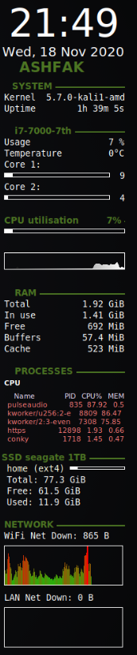
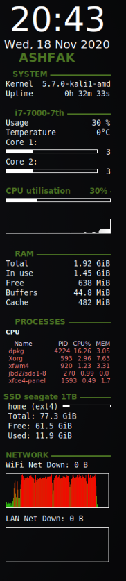
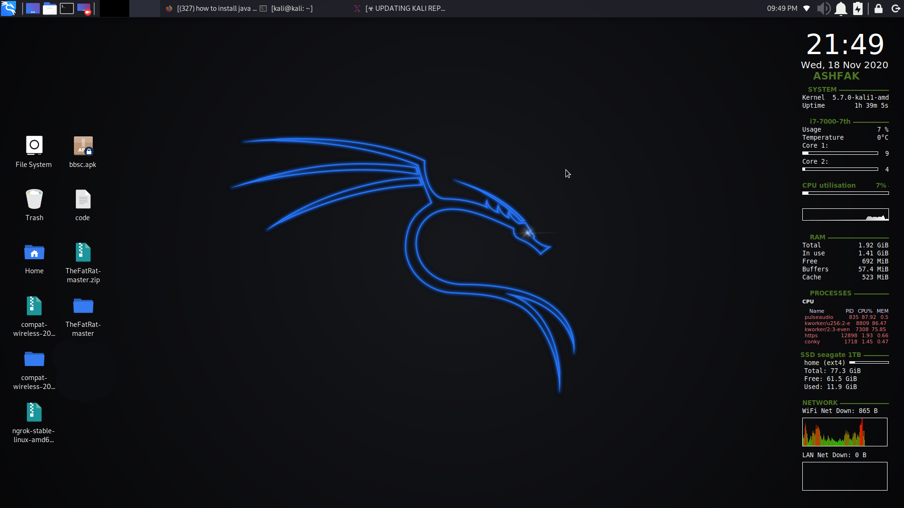

# Conky
This is a Conky configuration for kali linux that is drawn on your desktop background and offers related information about your system.

# Screenshots

 

# Features

Displays:
* Current time and date.
* CPU usage.
* Memory usage.
* Hard drive usage
* Network usage LAN and WAN.
* Operating system information.
* Battery charge and charging state.
